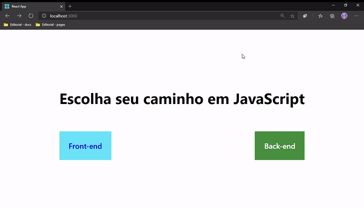
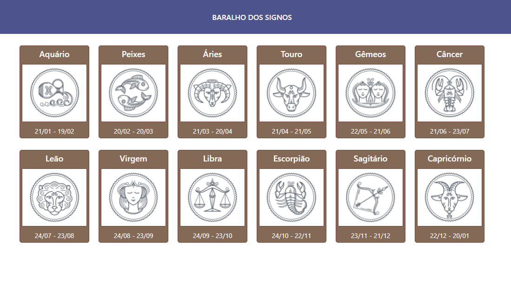

# react-studies

## primeiro-app

### First steps

Here we have the very basics of react, I used the main features of the React Framework, which are fundamental for applications of any kind, such as:

- Create a component;
- Export a component;
- Import a component;
- Stylize it using CSS.

## random-number

### Random Number (state hooks - onClick event)

When the user clicks the Generate Number button, a random number will be displayed in the label above.

Concepts applied in the project:

- State Hook
- onClick event

## routes

### Library react-router-dom

Use the library react-router-dom to create the routes for a SPA.

Concepts applied in the project:

- Components
- react-router-dom

## props

### Reuse components with props

Concepts applied in the project:

- Create components (import and export)
- Reuse components
- Use **props**

## props-in-tags

### Reuse components with props

In a project created in React, it is common to create and reuse a component. Through props we can insert tags and components inside another component.

Concepts applied in the project:

- Create components (import and export)
- Reuse components
- Use **props.children**

